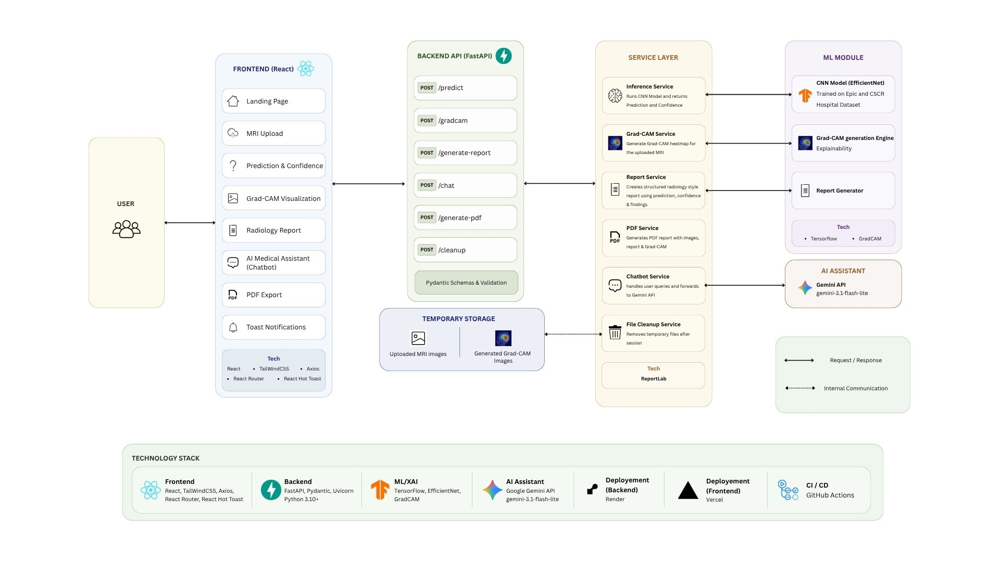
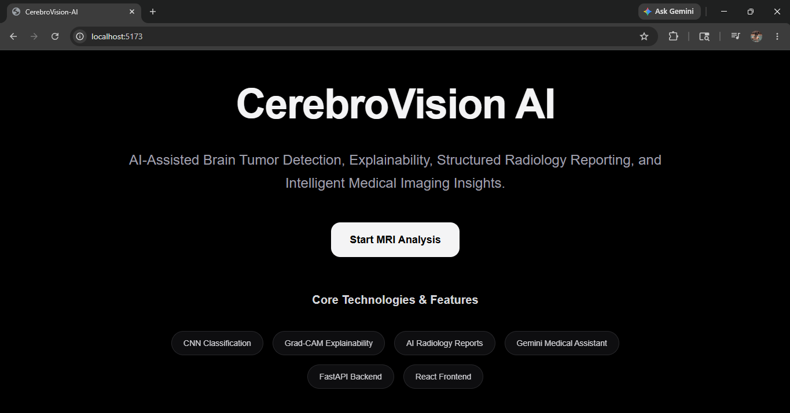
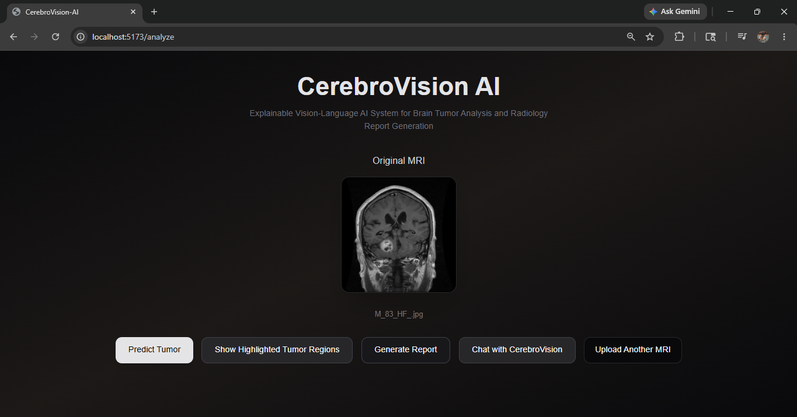
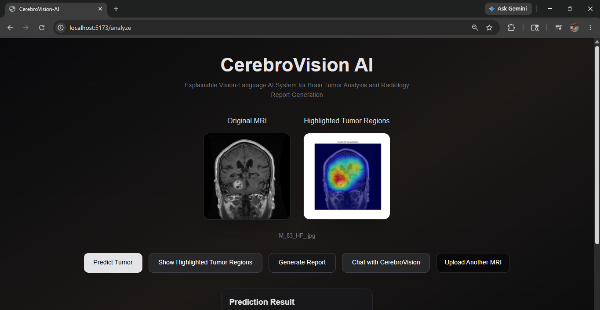
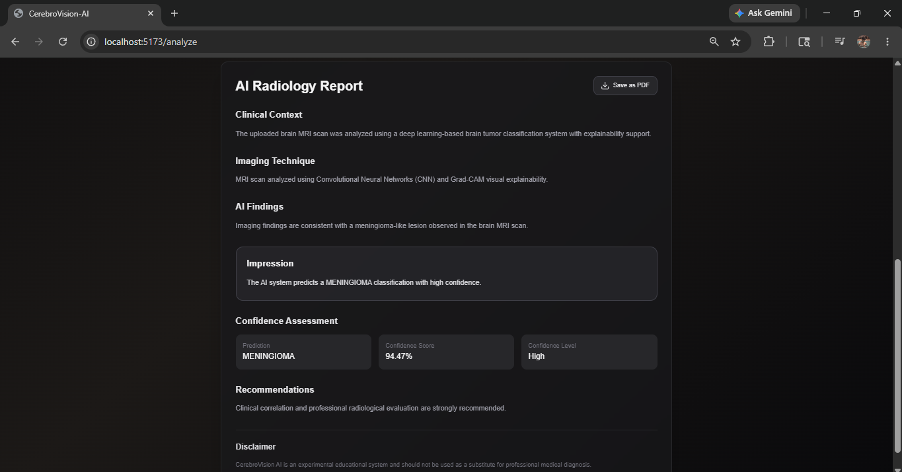
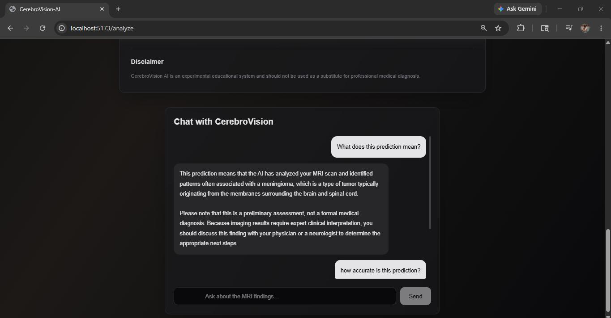
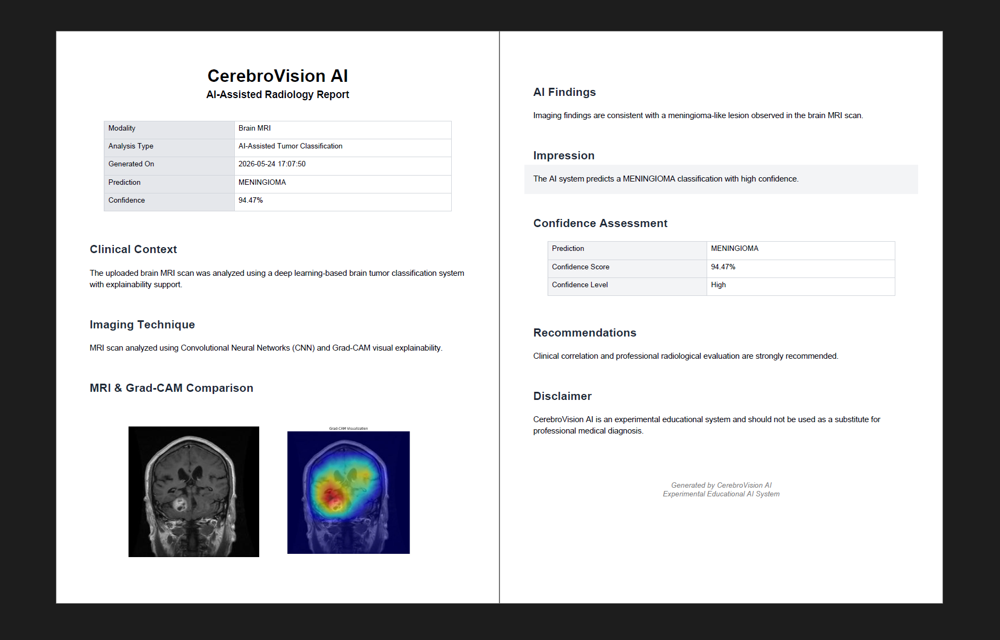

# CerebroVision AI

AI-Assisted Brain Tumor Detection, Explainability, Structured Radiology Reporting, and Medical Imaging Insights using Deep Learning and Gemini AI.

## Features

- Brain Tumor Classification using CNN
- Grad-CAM Explainability Visualization
- AI-Generated Radiology Reports
- Gemini-Powered Medical Chat Assistant
- PDF Report Export
- Interactive React Frontend
- FastAPI Backend Architecture
- Session-based Temporary File Cleanup
- Confidence Visualization System

---

## Architecture



---

## Screenshots

### Landing Page



--

### MRI Prediction & Confidence Visualization



--

### Grad-CAM Explainability



--

### AI Radiology Report



--

### Gemini Medical Assistant



--

### PDF Report


---
## Installation

### Frontend

```bash
cd frontend
npm install
npm run dev
```
### Backend

```bash
cd backend
pip install -r requirements.txt
uvicorn app.main:app --reload
```


---

## Environment Variables

Create a `.env` file inside backend:

```env
GEMINI_API_KEY=your_api_key
MODEL=gemini-3.0-flash-lite
```
---
## Deployement

Include:
- frontend link
- backend link

---
## Model Limitations
CerebroVision AI is an experimental educational AI-assisted medical imaging platform and has several important limitations:

- The CNN model was trained on a limited MRI dataset and may not generalize well to all real-world clinical scenarios.
- The model may produce incorrect classifications for low-quality, noisy, or previously unseen MRI scans.
- Grad-CAM visualizations provide approximate regions of model attention and do not precisely localize tumors.
- The model has not undergone regulatory approval, clinical trials, or medical certification.

---
## Disclaimer

CerebroVision AI is an educational and experimental AI-assisted medical imaging platform.
Predictions and reports generated by the system are NOT medical diagnoses and should not replace professional clinical evaluation by qualified radiologists or physicians.

---
## Future Improvements

- DICOM Support
- Multi-slice MRI Analysis
- Tumor Segmentation
- Multi-model Ensemble Learning
- Longitudinal Scan Comparison
- Clinical PACS Integration
